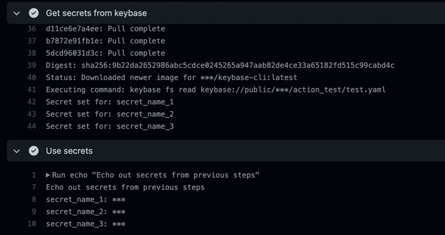
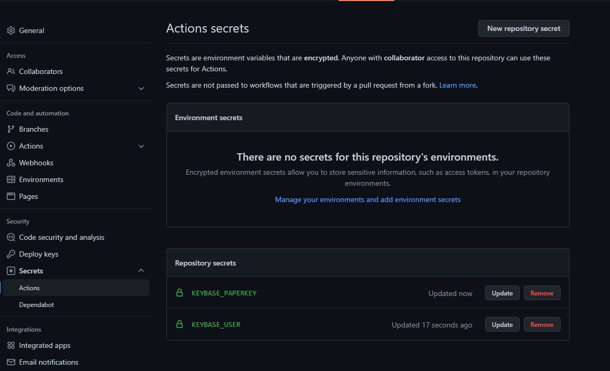

# keybase-action
[](https://github.com/bjgeiser/keybase-action/actions/workflows/Test%20Keybase%20Secrets.yaml)

GitHub action to use Keybase in a workflow.  This workflow makes use of https://github.com/bjgeiser/keybase-cli 
via docker to create a GitHub Action to import secrets, files or clone repositories into a GitHub action.

## Usage
```yaml
on:
  pull_request:
    branches: main
  push:
    branches: main
    tags:
      - '*'
  workflow_dispatch:

jobs:
  Keybase_Secret_Test:
    runs-on: [ubuntu-latest]
    steps:
      # Get the code
      - name: Checkout
        uses: actions/checkout@v2

      - name: Get secrets from keybase
        id: secrets
        uses: bjgeiser/keybase-action
        with:
          action_command: keybase://public/bjgeiser/action_test/test.yaml
          action_type: secrets
          keybase_user: ${{ secrets.KEYBASE_USER }}
          keybase_paperkey: ${{ secrets.KEYBASE_PAPERKEY }}

      - name: Use secrets
        shell: bash
        run: |
          echo "Echo out secrets from previous steps they should show as `****` in the workflow logs"
          echo "secret_name_1: ${{steps.secrets.outputs.secret_name_1}}"
          echo "secret_name_2: ${{steps.secrets.outputs.secret_name_2}}"
          echo "secret_name_3: ${{steps.secrets.outputs.secret_name_3}}"
```
## Inputs

| Inputs           | Description                                                                                     | Required |
|------------------|-------------------------------------------------------------------------------------------------|----------|
| keybase_user     | Keybase user name                                                                               | Yes      |
| keybase_paperkey | Keybase paper key                                                                               | Yes      |
| action_type      | Type of action to perform, including:  <br>`secrets`, `get`, `clone`, `raw`, `batch` amd `file` | Yes      |
| action_command   | Command to supply to action                                                                     | Yes      |
> **Note**: Use GitHub repository secrets to store your Keybase credentials See: [Secrets](#protecting-secrets)  

## Action Types
### Action Type: `secrets`

----
Load secrets into outputs for use in future steps
```yaml
- name: Get secrets from keybase
  id: secrets
  uses: bjgeiser/keybase-action
  with:
    action_command: keybase://public/bjgeiser/action_test/test.yaml
    action_type: secrets
    keybase_user: ${{ secrets.KEYBASE_USER }}
    keybase_paperkey: ${{ secrets.KEYBASE_PAPERKEY }}

- name: Use secrets
  shell: bash
  run: |
    echo "Echo out secrets from previous steps"
    echo "secret_name_1: ${{steps.secrets.outputs.secret_name_1}}"
    echo "secret_name_2: ${{steps.secrets.outputs.secret_name_2}}"
    echo "secret_name_3: ${{steps.secrets.outputs.secret_name_3}}"
```
#### Results


### Action Type: `get`

----
Get a file from keybase.
```yaml
- name: Run get command (no path)
  uses: bjgeiser/keybase-action
  with:
    action_command: keybase://public/bjgeiser/action_test/test.yaml
    action_type: get
    keybase_user: ${{ secrets.KEYBASE_USER }}
    keybase_paperkey: ${{ secrets.KEYBASE_PAPERKEY }}
```
```yaml
- name: Run get command (output path)
  uses: bjgeiser/keybase-action
  with:
    action_command: keybase://public/bjgeiser/action_test/test.yaml path/get-test.yaml
    action_type: get
    keybase_user: ${{ secrets.KEYBASE_USER }}
    keybase_paperkey: ${{ secrets.KEYBASE_PAPERKEY }}
```

### Action Type: `clone`

----
Clone a keybase git repository.

```yaml
- name: Run clone command
  uses: bjgeiser/keybase-action
  with:
    action_command: keybase://private/bjgeiser/action_test_repo
    action_type: clone
    keybase_user: ${{ secrets.KEYBASE_USER }}
    keybase_paperkey: ${{ secrets.KEYBASE_PAPERKEY }}

```
```yaml
- name: Run advanced clone command
  uses: bjgeiser/keybase-action
  with:
    action_command: -b main keybase://private/bjgeiser/action_test_repo repo_custom_folder
    action_type: clone
    keybase_user: ${{ secrets.KEYBASE_USER }}
    keybase_paperkey: ${{ secrets.KEYBASE_PAPERKEY }}
```

### Action Type: `raw`

---
Run a raw command
```yaml
- name: Raw command test
  uses: ./
  with:
    action_command: keybase fs cp keybase://public/bjgeiser/action_test/test.yaml raw-test.yaml
    action_type: raw
    keybase_user: ${{ secrets.KEYBASE_USER }}
    keybase_paperkey: ${{ secrets.KEYBASE_PAPERKEY }}
```

### Action Type: `batch`

---
Execute a batch of commands

> Command format can be found here: https://github.com/bjgeiser/keybase-cli#commands

```yaml
- name: Batch command test
  uses: bjgeiser/keybase-action
  with:
    action_command: get keybase://public/bjgeiser/action_test/test.yaml batch1-test.yaml, get keybase://public/bjgeiser/action_test/test.yaml batch2-test.yaml
    action_type: batch
    keybase_user: ${{ secrets.KEYBASE_USER }}
    keybase_paperkey: ${{ secrets.KEYBASE_PAPERKEY }}
```
### Action Type: `file`

---
Execute a series of commands from a file
```yaml
- name: File command test
  uses: bjgeiser/keybase-action
  with:
    action_command: .github/workflows/test/test_commands.yaml
    action_type: file
    keybase_user: ${{ secrets.KEYBASE_USER }}
    keybase_paperkey: ${{ secrets.KEYBASE_PAPERKEY }}
```
> Command format can be found here: https://github.com/bjgeiser/keybase-cli#commands

`.github/workflows/test/test_commands.yaml`
```yaml
commands:
  - keybase help
  # this will set masks and outputs for a given step
  - github-action-secrets keybase://public/bjgeiser/action_test/test.json
  - get keybase://public/bjgeiser/action_test/test.json file-test.json
  - get keybase://public/bjgeiser/action_test/test.yaml file-test.yaml
  - chmod a+rw test.yaml
  - chmod a+rw mangle2.json
  - ls -lha
```

## Protecting Secrets
